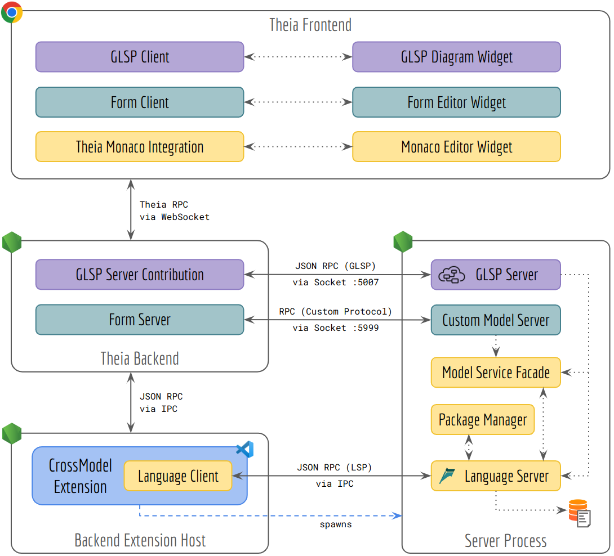

# Architecture Overview

The general architecture of CrossModel consists of several parts that aim to share a common data model and support different editing capabilities on that model.

## Textual Modeling with Langium

The support for textual modeling is provided through a [language server](https://microsoft.github.io/language-server-protocol/overviews/lsp/overview/ 'Language Server Protocol') implementation based on the [Langium](https://langium.org/) framework.
The Langium framework creates the language server infrastructure based on a given grammar and provides a document store for semantic models / AST nodes.
In our architecture, we use the language server and the document store as the source of truth for our modeling.

When the application is started, our CrossModel VS Code extension will start the server process, initialize the language server and provide the textual modeling capabilities through the generic language client.
During initialization of the language server, the whole workspace is scanned and the documents as well an index of node descriptions for linking, and a package system for project-like semantics, is created.
If the user makes any changes using the [Monaco editor](https://microsoft.github.io/monaco-editor/) in the Theia frontend, the document store will get updated accordingly.

The code responsible for this functionality can be found in [`extension.ts`](../extensions/crossmodel-lang/src/extension.ts) for the language client and starting the server process, [`main.ts`](../extensions/crossmodel-lang/src/main.ts) for the actual server process and the [`language-server`](../extensions/crossmodel-lang/src/language-server/) directory for the overall language server implementation.

### Package Manager

In general, the language server protocol does not contain any dedicated project-like semantics, only the concept of a workspace.
In CrossModel, however, we want to be able to support multiple closed systems where elements can only be referenced within that system but also allow references between systems if declared explicitly.
For this reason, we are defining that any directory with a [`package.json`](https://docs.npmjs.com/cli/v9/configuring-npm/package-json) file is considered a closed system and can only see elements within that system as well as any direct or indirect dependency declared through the `package.json`.
By re-using the `package.json` format from npm, we also gain automatic support for publishing systems and libraries on an npm registry that can be automatically downloaded throught he npm CLI.
The task of the package manager is to introduce that mechanism in the language server.

The code responsible for this functionality can be found in [`cross-model-package-manager.ts`](../extensions/crossmodel-lang/src/language-server/cross-model-package-manager.ts).

### Model Service Facade

The language server is implemented with the language server protocol in mind, having textual documents as the core concept and performing any communication through the RPC protocol.
The resulting encapsulation makes it difficult for non-LSP clients to access the documents and the semantic models behind them.
We therefore explicitly create a Model Service Facade that exposes a simple open-request-update-save/close lifecycle for documents and their semantic model for non-LSP clients but internally ensures that all necessary LSP events are triggered.

The code responsible for this functionality can be found in [`model-service.ts`](../extensions/crossmodel-lang/src/model-server/model-service.ts).

## Graphical Modeling with GLSP

The support for graphical modeling is provided thorugh a graphical language server implemented based on the [GLSP](https://www.eclipse.org/glsp/) framework. As the language server serves as our single source of truth, the GLSP server should also use the document store as a data source and ensure that any persisted changes are synced back to the store. To ease that integration without any additional protocol, we start a Node-based GLSP server in the same process as the Langium server and provide access to any necessary functionality through exposed language services.

When the user opens a diagram in the frontend, the GLSP client communicates through a contribution in the backend with the GLSP server to [load](https://www.eclipse.org/glsp/documentation/sourcemodel/) the [GModel](https://www.eclipse.org/glsp/documentation/gmodel/) and render it in the widget. On the server, we load the document from the language service and translate the semantic model into the GModel. Any operations that the user performs based on the GModel in the frontend are translated back to changes in the semantic model and the GModel is re-generated. If the user changes the model, the document in the document store is updated with the current version of the semantic model and any listeners for that document are notified.

The code responsible for this functionality can be found in the [`glsp-server`](../extensions/crossmodel-lang/src/glsp-server/) directory and the [`glsp-client`](../packages/glsp-client) package.

## Form-Based Modeling

The support for form-based modeling is provided through a custom solution: The generic Model Service Facade is exposed through a custom RPC protocol by a dedicated Model Server. This model server ensures that the semantic model which may contain cyclic references can be serialized and sent to a custom client to the Theia backend. That client servers as a server to the Theia frontend so that the serializable semantic models are available there as well.

When the user opens a file with the form-based editor, the custom widget retrieves the semantic model for an opened URI and renders the data down in an HTML form. Any updates to the semantic model in the widget trigger a full update on the server. If the user hits the Save button, the document in the document store is updated with the current version of the semantic model and any listeners for that document are notified.

The code responsible for this functionality can be found in the [`model-server`](../extensions/crossmodel-lang/src/model-server/) directory and the [`form-client`](../packages/form-client) package.

## Syncing Modeling Perspectives

To sync the different modeling perspectives (textual, graphical, form-based, properties) we use the central document store from Langium as global state that is shared among all clients.
The lifecycle of a document is aligned with the expected lifecycle of the [language server protocol](https://microsoft.github.io/language-server-protocol/overviews/lsp/overview/) where the `open` call transfers the document content from the client to the server which is now the source of truth until the document is `closed` again.
Each update from the client changes the in-memory state of the server and increases its internal version number.

In CrossModel, we enhance that lifecycle to support a multi-client scenario where only the first `open` call needs to transfer the content (usually the content of the file on the filesystem) and subsequent open calls are ignored as the server already holds the source of truth for the document.
In-between the open and close calls, clients are free to send updates to the server.
To allow live syncing, any state resulting from applying an update is forwarded to all clients with the information of which client triggered the update.
This allows each client to decide whether to apply or discard an update based on their internal model and makes it easy to avoid update-cycles.
A special case for this is the textual Monaco language client that we update directly from the server using the [`applyEdit`](https://microsoft.github.io/language-server-protocol/specifications/lsp/3.17/specification/#workspace_applyEdit) request, as we cannot register the language client to our custom listener mechanism.
Currently, we only support full updates where we always receive the complete model (or text) and also replace the complete model (or text) in the clients.
After the last client `closes` the document, the server cleans its in-memory state and does not accept any updates unless a client opens the document for modification again.
